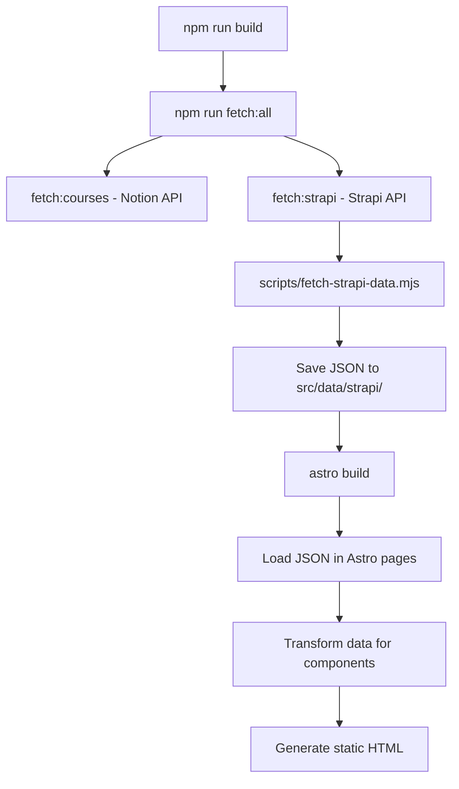

# 🏗️ Strapi Integration Architecture Guide

> **Purpose**: Complete guide to understanding the Strapi CMS integration architecture for Vanessa Ramirez website. This document explains not just _what_ each component does, but _why_ it was designed that way and how it fits into the larger system.

---

## 📋 **Table of Contents**

1. [Architecture Overview](#architecture-overview)
2. [Data Flow Pipeline](#data-flow-pipeline)
3. [File Structure & Purpose](#file-structure--purpose)
4. [Key Design Decisions](#key-design-decisions)
5. [Data Transformation Strategy](#data-transformation-strategy)
6. [Error Handling & Resilience](#error-handling--resilience)
7. [Common Pitfalls & Solutions](#common-pitfalls--solutions)
8. [Extension & Maintenance Guide](#extension--maintenance-guide)

---

## 🎯 **Architecture Overview**

### **High-Level Concept**

The Strapi integration follows a **"Build-Time Data Fetching with Runtime Fallbacks"** pattern:

```
Strapi CMS → Build Script → JSON Files → Astro Pages → Static Site
     ↓              ↓            ↓           ↓            ↓
  Content       Pre-fetch    Local Cache  Transform   Production
  Management    at Build     Static Data   & Render    Website
```

### **Core Principles**

1. **🏗️ Build-Time First**: Fetch data during build process, not at runtime
2. **🛡️ Graceful Degradation**: Always have fallback data if Strapi is unavailable
3. **📦 Static Generation**: All content becomes static files for optimal performance
4. **🔄 Flexible Data Structures**: Handle both API responses and flattened JSON
5. **⚡ Zero Runtime Dependencies**: No client-side API calls to Strapi

---

## 🔄 **Data Flow Pipeline**

### **1. Build Process Sequence**



### **2. Data Sources & Destinations**

| Source     | Process                 | Destination                     | Purpose            |
| ---------- | ----------------------- | ------------------------------- | ------------------ |
| Strapi CMS | `fetch-strapi-data.mjs` | `src/data/strapi/homepage.json` | Homepage content   |
| Strapi CMS | `fetch-strapi-data.mjs` | `src/data/strapi/about.json`    | About page content |
| Notion API | `fetch-notion-data.mjs` | `src/content/courses/`          | Course/event data  |

---

## 📁 **File Structure & Purpose**

### **Core Integration Files**

```
src/
├── lib/
│   ├── strapi.ts              # 🔌 API client & TypeScript interfaces
│   └── strapi-data.ts         # 🔄 Data loading & transformation utilities
├── data/strapi/               # 📦 Build-time generated JSON cache
│   ├── homepage.json          # 🏠 Homepage content data
│   └── about.json             # 👤 About page content data
├── pages/
│   ├── index.astro            # 🏠 Homepage (uses Strapi data)
│   └── acerca-de-mi.astro     # 👤 About page (uses Strapi data)
└── scripts/
    └── fetch-strapi-data.mjs  # 🚀 Build-time data fetching script
```

### **File Deep Dive**

#### **`src/lib/strapi.ts` - API Foundation**

```typescript
// Purpose: Single source of truth for Strapi API communication
// Why: Centralized configuration, type safety, reusable functions

// 🔑 Key Components:
export const STRAPI_URL = process.env.STRAPI_URL || "fallback-url";
export const STRAPI_API_TOKEN = process.env.STRAPI_API_TOKEN;

// 📝 TypeScript Interfaces - Define expected data structures
export interface HomepageAbout {
  id: number;
  attributes: {
    title: string;
    content: string;
    image?: StrapiImageData; // Optional for flexibility
    buttonText?: string;
    buttonLink?: string;
  };
}

// 🌐 API Functions - Abstracted HTTP calls
export async function getHomepageAbout(): Promise<HomepageAbout | null>;
```

**Design Reasoning**:

- **TypeScript Interfaces**: Provide compile-time safety and IDE autocomplete
- **Optional Properties**: Handle cases where Strapi data might be incomplete
- **Null Returns**: Graceful handling of API failures
- **Environment Variables**: Secure, environment-specific configuration

#### **`src/lib/strapi-data.ts` - Data Bridge**

```typescript
// Purpose: Bridge between raw Strapi data and Astro component needs
// Why: Decouples API structure from component requirements

// 🔄 Transformation Functions
export function transformHomepageAbout(homepageAbout: any) {
  // Handle both flattened (JSON) and nested (API) structures
  const data = homepageAbout.attributes
    ? homepageAbout.attributes
    : homepageAbout;
  const image = data.image?.data ? data.image.data : data.image;

  return {
    imageUrl: getImageUrl(image || null) || "/images/img-placeholder.jpg",
    content: `<h2>${data.title}</h2>${data.content}`,
    // ... component-specific format
  };
}
```

**Design Reasoning**:

- **Flexible Input Types**: Uses `any` to handle both API and JSON structures
- **Data Normalization**: Converts various input formats to consistent output
- **Fallback Values**: Always provides defaults for missing data
- **Component-Specific Output**: Transforms to match Astro component props

#### **`scripts/fetch-strapi-data.mjs` - Build-Time Orchestrator**

```javascript
// Purpose: Orchestrate data fetching during build process
// Why: Ensures static site has all content, handles build-time failures gracefully

async function main() {
  // 🛡️ Environment Check
  if (!process.env.STRAPI_API_TOKEN) {
    console.warn("Using fallback data - no Strapi token");
    // Save fallback data and continue build
    return;
  }

  // 🔄 Parallel Data Fetching
  const [homepageData, aboutData] = await Promise.all([
    getHomepageData().catch((error) => {
      console.warn("Strapi fetch failed, using fallbacks");
      return defaultHomepageData;
    }),
  ]);

  // 💾 Save to Static Files
  await fs.writeFile(filePath, JSON.stringify(data, null, 2));
}
```

**Design Reasoning**:

- **Build-Time Execution**: Runs during `npm run build`, not at runtime
- **Graceful Failure**: Never fails the build, always provides fallback data
- **Parallel Fetching**: Optimizes build performance
- **Static File Generation**: Creates JSON files that become part of the build

---

## 🎯 **Key Design Decisions**

### **1. Build-Time vs Runtime Fetching**

**Decision**: Fetch data at build time, not runtime
**Why**:

- ⚡ **Performance**: Zero API calls from client browsers
- 🛡️ **Reliability**: Site works even if Strapi is down
- 💰 **Cost**: No runtime API quota usage
- 🔒 **Security**: API tokens never exposed to client

### **2. Dual Data Structure Support**

**Decision**: Support both nested (API) and flattened (JSON) data structures
**Why**:

- 🔄 **API Evolution**: Handles changes in Strapi API format
- 📦 **JSON Optimization**: Build script may flatten structures for performance
- 🛠️ **Development Flexibility**: Works with direct API calls and cached files
- 🐛 **Debugging**: Easier to troubleshoot different data sources

**Example**:

```typescript
// Handles both:
// API: { attributes: { image: { data: {...} } } }
// JSON: { image: {...} }
const data = item.attributes ? item.attributes : item;
const image = data.image?.data ? data.image.data : data.image;
```

### **3. Transformation Layer Strategy**

**Decision**: Separate transformation functions for each content type
**Why**:

- 🧩 **Modularity**: Each function handles one specific data type
- 🔄 **Reusability**: Same transformations work across different pages
- 🐛 **Debugging**: Easy to isolate issues to specific content types
- 📏 **Consistency**: Standardized output format for components

### **4. Fallback Data Architecture**

**Decision**: Comprehensive fallback system at multiple levels
**Why**:

- 🛡️ **Build Resilience**: Build never fails due to external API issues
- 👥 **Team Collaboration**: Developers can work without Strapi access
- 🚀 **Deployment Safety**: Deployments work even during Strapi maintenance
- 🎯 **User Experience**: Site always has content, never shows errors

**Fallback Hierarchy**:

```
1. Live Strapi Data (preferred)
2. Cached JSON Data (if Strapi fails)
3. Hardcoded Fallbacks (if both fail)
4. Graceful Component Defaults (last resort)
```

### **5. Content-Type Specifics: Testimonials**

**Problem**: Originally, a testimonial could only be assigned to a single page (`homepage`, `about`, or one `course`). This required duplicating content if a testimonial was relevant in multiple places.

**Solution**: The `testimonial` content-type was restructured to allow flexible, multi-page assignments.

- `page` and `target_page` fields were removed.
- Added `show_on_homepage` (boolean) and `show_on_about_page` (boolean).
- The relationship to `cursos` was changed to `manyToMany`.

This allows an editor to use checkboxes to place a testimonial on the homepage, about page, and associate it with multiple courses simultaneously.

#### **Updated `Testimonial` Interface Example**

This is how the new `Testimonial` interface should look in the frontend code (`src/lib/strapi.ts`):

```typescript
export interface Testimonial {
  id: number;
  attributes: {
    quote: string;
    authorName: string;
    authorTitle: string;
    order: number;
    show_on_homepage: boolean;
    show_on_about_page: boolean;
    cursos?: StrapiRelation<Course[]>; // Many-to-many relationship
  };
}
```

#### **API Query Example**

To fetch testimonials and their related courses, you must populate the `cursos` relation:

```bash
/api/testimonials?populate=cursos
```

#### **Transformation Logic Example**

A transformation function on the frontend can then process the data for the components:

```typescript
// src/lib/strapi-data.ts
export function transformTestimonial(testimonial: any) {
  if (!testimonial) return null;

  const data = testimonial.attributes ? testimonial.attributes : testimonial;

  return {
    quote: data.quote,
    author: `${data.authorName}, ${data.authorTitle}`,
    // The following properties can be used to filter testimonials on the frontend
    showOnHomepage: data.show_on_homepage,
    showOnAboutPage: data.show_on_about_page,
    // Related course slugs can be extracted for filtering
    relatedCourses: data.cursos?.data?.map((c) => c.attributes.slug) || [],
  };
}
```

---

## 🔄 **Data Transformation Strategy**

### **The Challenge: Data Structure Mismatch**

Strapi's API returns data in a specific nested format, but components need simpler, flattened data:

```typescript
// Strapi API Response
{
  data: {
    id: 1,
    attributes: {
      title: "About Me",
      image: {
        data: {
          attributes: {
            url: "/uploads/image.jpg"
          }
        }
      }
    }
  }
}

// Component Needs
{
  title: "About Me",
  imageUrl: "https://cdn.example.com/uploads/image.jpg"
}
```

### **Solution: Flexible Transformation Functions**

```typescript
export function transformHomepageAbout(homepageAbout: any) {
  if (!homepageAbout) return null;

  // 🔍 Detect data structure
  const data = homepageAbout.attributes
    ? homepageAbout.attributes
    : homepageAbout;
  const image = data.image?.data ? data.image.data : data.image;

  // 🔄 Transform to component format
  return {
    imageUrl: getImageUrl(image || null) || "/images/img-placeholder.jpg",
    content: `<h2>${data.title}</h2>${data.content}`,
    reverseOrder: false,
    buttonText: data.buttonText,
    buttonLink: data.buttonLink,
  };
}
```

### **Why This Approach Works**

1. **🔍 Structure Detection**: Automatically handles different input formats
2. **🛡️ Null Safety**: Prevents crashes from missing data
3. **🎯 Component Optimization**: Output matches exactly what components expect
4. **📏 Consistency**: All transformation functions follow same pattern

---

## 🛡️ **Error Handling & Resilience**

### **Multi-Layer Error Handling**

#### **Layer 1: Build Script Level**

```javascript
try {
  const homepageData = await getHomepageData();
  await fs.writeFile(filePath, JSON.stringify(homepageData, null, 2));
} catch (error) {
  console.warn("Strapi fetch failed, using fallback data");
  await fs.writeFile(filePath, JSON.stringify(defaultHomepageData, null, 2));
  // ✅ Build continues, never fails
}
```

#### **Layer 2: API Function Level**

```typescript
export async function getHomepageAbout(): Promise<HomepageAbout | null> {
  try {
    const response = await strapiApi.get("/homepage-about?populate=image");
    return response.data.data;
  } catch (error) {
    console.error("Error fetching homepage about:", error);
    return null; // ✅ Graceful degradation
  }
}
```

#### **Layer 3: Page Component Level**

```typescript
// Always have fallback data ready
const homepageAboutData = strapiData?.homepageAbout
  ? transformHomepageAbout(strapiData.homepageAbout)
  : null;

const placeholderData = homepageAboutData || fallbackPlaceholderData;
```

#### **Layer 4: Transformation Level**

```typescript
export function transformHomepageAbout(homepageAbout: any) {
  if (!homepageAbout) return null; // ✅ Handle null input

  return {
    imageUrl: getImageUrl(image || null) || "/images/img-placeholder.jpg", // ✅ Always have image
    content: `<h2>${data.title || "Default Title"}</h2>${
      data.content || "Default content"
    }`,
  };
}
```

---

## ⚠️ **Common Pitfalls & Solutions**

### **Pitfall 1: Data Structure Assumptions**

**❌ Problem**:

```typescript
// Assumes data always has specific structure
const imageUrl = homepageAbout.attributes.image.data.attributes.url;
// ☠️ Crashes if any property is undefined
```

**✅ Solution**:

```typescript
// Flexible structure handling
const data = homepageAbout.attributes
  ? homepageAbout.attributes
  : homepageAbout;
const image = data.image?.data ? data.image.data : data.image;
const imageUrl = getImageUrl(image || null) || "/images/img-placeholder.jpg";
```

### **Pitfall 2: Build Failures from API Issues**

**❌ Problem**:

```javascript
// Build fails if Strapi is down
const data = await getHomepageData(); // Throws error
await fs.writeFile(filePath, JSON.stringify(data, null, 2));
```

**✅ Solution**:

```javascript
// Build continues with fallbacks
try {
  const data = await getHomepageData();
  await fs.writeFile(filePath, JSON.stringify(data, null, 2));
} catch (error) {
  console.warn("Using fallback data");
  await fs.writeFile(filePath, JSON.stringify(fallbackData, null, 2));
}
```

### **Pitfall 3: TypeScript Strict Typing Issues**

**❌ Problem**:

```typescript
// Too strict typing prevents flexibility
function transform(data: StrictInterface) {
  // Can't handle variations in data structure
}
```

**✅ Solution**:

```typescript
// Use 'any' for transformation inputs to handle flexibility
function transform(data: any) {
  // Runtime structure detection instead of compile-time assumptions
  const actualData = data.attributes ? data.attributes : data;
}
```

### **Pitfall 4: Missing Environment Variables**

**❌ Problem**:

```javascript
// Fails silently or crashes build
const response = await fetch(STRAPI_URL, {
  headers: { Authorization: `Bearer ${STRAPI_API_TOKEN}` },
});
```

**✅ Solution**:

```javascript
// Explicit environment validation
if (!process.env.STRAPI_API_TOKEN) {
  console.warn("STRAPI_API_TOKEN not found, using fallback data");
  return defaultData;
}
```

---

## 🔧 **Extension & Maintenance Guide**

### **Adding New Content Types**

#### **Step 1: Define TypeScript Interface**

```typescript
// src/lib/strapi.ts
export interface NewContentType {
  id: number;
  attributes: {
    title: string;
    // ... other fields
    image?: StrapiImageData;
  };
}
```

#### **Step 2: Create API Function**

```typescript
// src/lib/strapi.ts
export async function getNewContentType(): Promise<NewContentType | null> {
  try {
    const response = await strapiApi.get<StrapiSingleResponse<NewContentType>>(
      "/new-content-type?populate=image"
    );
    return response.data.data;
  } catch (error) {
    console.error("Error fetching new content type:", error);
    return null;
  }
}
```

#### **Step 3: Add Transformation Function**

```typescript
// src/lib/strapi-data.ts
export function transformNewContentType(content: any) {
  if (!content) return null;

  const data = content.attributes ? content.attributes : content;
  const image = data.image?.data ? data.image.data : data.image;

  return {
    title: data.title,
    imageUrl: getImageUrl(image || null) || "/images/img-placeholder.jpg",
    // ... component-specific transformations
  };
}
```

#### **Step 4: Update Build Script**

```javascript
// scripts/fetch-strapi-data.mjs
const newContentData = await getNewContentType();
const newContentFilePath = path.join(DATA_OUTPUT_DIR, "new-content.json");
await fs.writeFile(newContentFilePath, JSON.stringify(newContentData, null, 2));
```

#### **Step 5: Use in Astro Pages**

```typescript
// src/pages/new-page.astro
import {
  loadNewContentData,
  transformNewContentType,
} from "../lib/strapi-data";

const strapiData = loadNewContentData();
const transformedData = strapiData?.newContent
  ? transformNewContentType(strapiData.newContent)
  : fallbackData;
```

### **Debugging Checklist**

1. **🔍 Check Environment Variables**:

   ```bash
   echo $STRAPI_URL
   echo $STRAPI_API_TOKEN
   ```

2. **🌐 Test API Endpoints Directly**:

   ```bash
   curl -H "Authorization: Bearer $STRAPI_API_TOKEN" \
        "$STRAPI_URL/api/homepage-about?populate=image"
   ```

3. **📁 Verify JSON Files Generated**:

   ```bash
   ls -la src/data/strapi/
   cat src/data/strapi/homepage.json | jq '.'
   ```

4. **🔄 Test Transformation Functions**:
   ```typescript
   // Add console.log in transformation functions
   export function transformHomepageAbout(homepageAbout: any) {
     console.log("Input data:", JSON.stringify(homepageAbout, null, 2));
     // ... rest of function
   }
   ```

### **Performance Optimization**

1. **🚀 Parallel API Calls**:

   ```javascript
   const [homepage, about, testimonials] = await Promise.all([
     getHomepageData(),
     getAboutPageData(),
     getTestimonials(),
   ]);
   ```

2. **📦 Selective Data Fetching**:

   ```javascript
   // Only populate needed relationships
   "/homepage-about?populate=image"; // Not ?populate=*
   ```

3. **💾 Optimize JSON Output**:
   ```javascript
   // Remove unnecessary fields before saving
   const optimizedData = {
     title: data.title,
     content: data.content,
     // Don't save metadata like createdAt, updatedAt
   };
   ```

---

## 🎯 **Conceptual Goals & Philosophy**

### **Why This Architecture?**

1. **🏗️ JAMstack Principles**: Pre-built, API-driven, markup-focused
2. **⚡ Performance First**: Zero runtime API calls, optimal loading
3. **🛡️ Resilience**: Never depends on external services being available
4. **👥 Developer Experience**: Easy to work with, debug, and extend
5. **🔄 Content Management**: Non-technical users can update content via Strapi

### **Trade-offs Made**

| **Benefit**                 | **Trade-off**                      |
| --------------------------- | ---------------------------------- |
| ⚡ Fast loading             | 🔄 Content updates require rebuild |
| 🛡️ High reliability         | 💾 Larger build artifacts          |
| 🔒 Secure (no API exposure) | 🔧 More complex build process      |
| 💰 Lower runtime costs      | ⏱️ Longer build times              |

### **When to Use This Pattern**

✅ **Good for**:

- Marketing websites
- Blogs and content sites
- Portfolio websites
- Landing pages
- Sites with infrequent content updates

❌ **Not ideal for**:

- Real-time applications
- User-generated content platforms
- E-commerce with inventory changes
- Social media applications

---

## 🚀 **Quick Start for New Developers**

### **1. Environment Setup**

```bash
# Copy environment variables
cp .env.example .env.local

# Add your Strapi credentials
STRAPI_URL=https://your-strapi-instance.com/api
STRAPI_API_TOKEN=your-api-token
```

### **2. Test Data Fetching**

```bash
# Test Strapi connection
npm run fetch:strapi

# Verify JSON files created
ls src/data/strapi/
```

### **3. Build & Deploy**

```bash
# Full build process
npm run build

# Verify all pages generated
ls dist/
```

### **4. Development Workflow**

```bash
# Development with hot reload
npm run dev

# Content updates in Strapi require:
npm run fetch:strapi  # Fetch new data
# Restart dev server to see changes
```

---

## 📚 **Further Reading**

- [Strapi Documentation](https://docs.strapi.io/)
- [Astro Static Site Generation](https://docs.astro.build/en/guides/static-site-generation/)
- [JAMstack Architecture](https://jamstack.org/)
- [Build-Time Data Fetching Patterns](https://www.netlify.com/blog/2020/12/18/understanding-static-site-generation/)

---

_This documentation is designed to be comprehensive yet practical. When in doubt, follow the patterns established in existing code, and always prioritize graceful degradation over strict enforcement._
